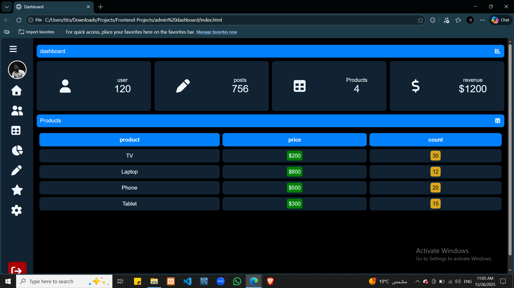
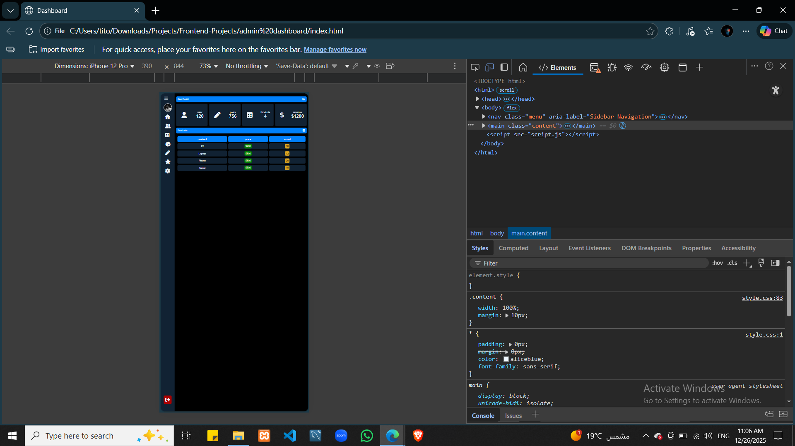

# Admin Dashboard UI

A responsive admin dashboard interface built using HTML, CSS, and JavaScript.  
The project focuses on layout structure, UI components, and basic interactivity.

## Features
- Collapsible sidebar navigation
- Statistic summary cards
- Dynamic products table
- Responsive layout
- Lightweight JavaScript-based interactions

## Tech Stack
- HTML5
- CSS3
- JavaScript
- Font Awesome

## Screenshots
|  |  |

## Notes
This project was built as a frontend fundamentals exercise, focusing on:
- Clean layout structuring
- UI consistency
- Practical DOM manipulation
- Separation of concerns (HTML / CSS / JS)
