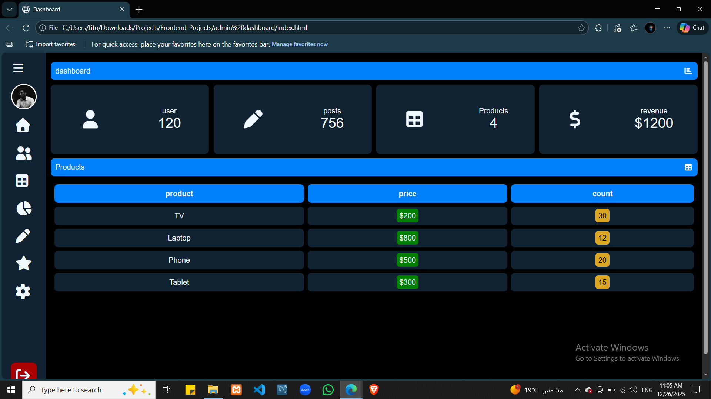
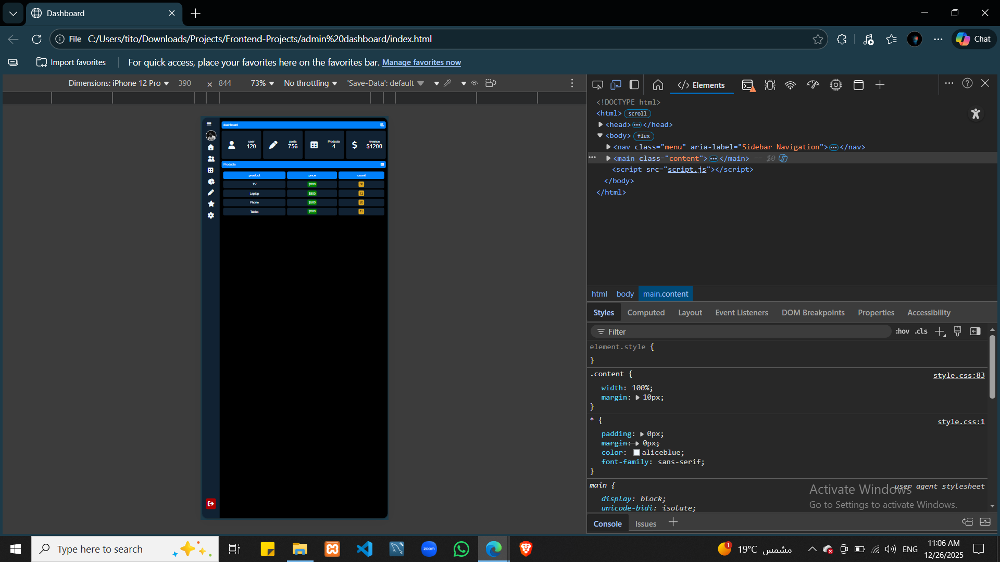

Admin Dashboard UI
Frontend dashboard interface designed to simulate an admin panel for managing backend systems and visualizing data.

Purpose
This project focuses on building a clean and responsive interface that could integrate with backend APIs for system monitoring, user management, and analytics.

Key Features
Responsive admin dashboard layout
Sidebar navigation with collapsible behavior
Data visualization cards (mock data)
Dynamic table rendering using JavaScript
Modular UI structure for easy backend integration

Tech Stack
HTML5
CSS3
JavaScript

Future Improvements
Connect dashboard to real backend APIs
Add authentication and role-based views
Integrate real-time data updates

Screenshots
|  |  |

Notes
This project was built as a frontend fundamentals exercise, focusing on:
- Clean layout structuring
- UI consistency
- Practical DOM manipulation
- Separation of concerns (HTML / CSS / JS)
